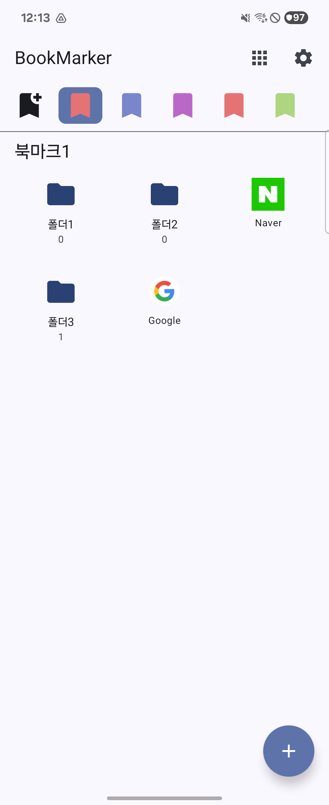
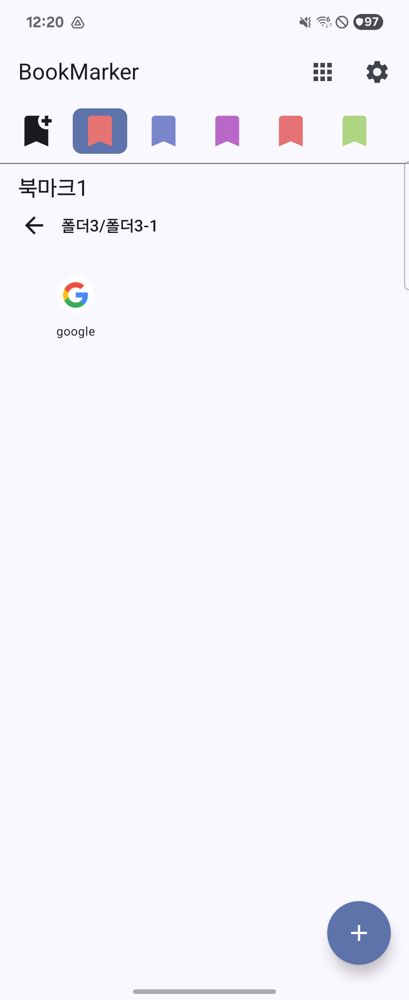

<h1 align="center">BookMarker</h1>

  

## 앱 소개

BookMarker는 브라우저 북마크 HTML 파일을 앱으로 가져와 폴더 구조 그대로 탐색할 수 있게 해줍니다.  
또한 기본 브라우저 선택, 테마 선택, 폴더 아이콘 스타일(모양/색상) 같은 개인화 설정을 제공합니다.

## 스크린샷

  
  

## 기술 스택

- **Language**: Kotlin
- **UI**: Jetpack Compose + Material3
- **Architecture**: Multi-module + MVI
  - `feature:home`: Orbit MVI
  - `feature:settings`: Mavericks
- **Dependency Injection**: Hilt
- **Storage**
  - Preferences DataStore
  - DataStore 기반 스냅샷 저장
- **Navigation**: Navigation Compose + Kotlin Serialization 기반 타입 세이프 라우팅
- **Build**
  - Java/Kotlin 17
  - Min SDK 28 / Compile SDK 36 / Target SDK 36

## 프로젝트 구조

- `app`: 앱 진입점, 앱 레벨 초기화
- `build-logic`: 빌드 스크립트
- `feature:`
  - `home`: 홈 화면, 북마크 가져오기/탐색/열기
  - `importguide`: 브라우저별 북마크 가져오기 가이드
  - `settings`: 설정(기본 브라우저, 테마, 폴더 아이콘 스타일)
- `core:`
  - `navigation`: 앱 라우팅, 외부 앱/브라우저 실행
  - `domain`: UseCase 계층
  - `data`: Repository 구현
  - `datastore`: DataStore 접근 계층
  - `model`: 도메인 모델
  - `ui`: 공통 UI 컴포넌트/리소스
  - `designsystem`, `common`: 공통 디자인/유틸
